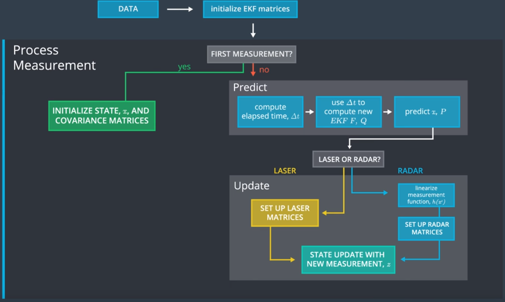
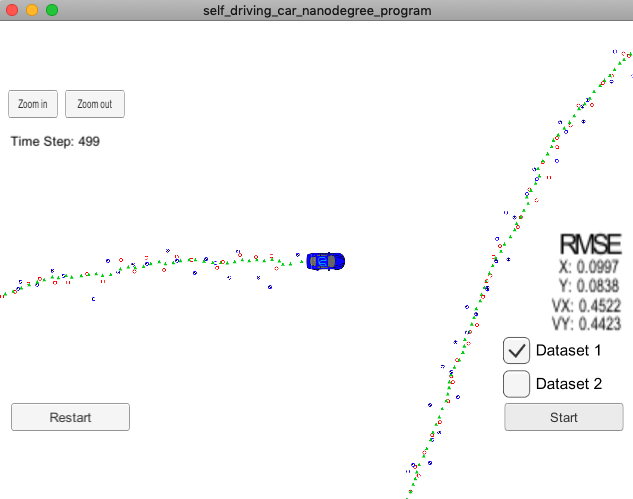

# Extended Kalman Filter Project Starter Code

## Overview
In this project you will utilize a kalman filter to estimate the state of a moving object of interest with noisy lidar and radar measurements. Passing the project requires obtaining RMSE values that are lower than the tolerance outlined in the project rubric. 

This project involves the Term 2 Simulator which can be downloaded [here](https://github.com/udacity/self-driving-car-sim/releases).

This repository includes two files that can be used to set up and install [uWebSocketIO](https://github.com/uWebSockets/uWebSockets) for either Linux or Mac systems. For windows you can use either Docker, VMware, or even [Windows 10 Bash on Ubuntu](https://www.howtogeek.com/249966/how-to-install-and-use-the-linux-bash-shell-on-windows-10/) to install uWebSocketIO. Please see the uWebSocketIO Starter Guide page in the classroom within the EKF Project lesson for the required version and installation scripts.

Once the install for uWebSocketIO is complete, the main program can be built and run by doing the following from the project top directory.

1. mkdir build
2. cd build
3. cmake ..
4. make
5. ./ExtendedKF

## Program Flow:
This program follows the flow of this chart:

## Kalman Filter Algorithm
Prediction:
* x′ =Fx+u (11)
* P′=FPFT+Q

Measurement Update:
* x′ =Fx+u (11) P′=FPFT+Q
* y = z − Hx′ (13) S=HP′HT+R (14) K = P′HT S−1
* x = x′ + Ky (16) P=(I−KH)P′
The measurement function can be found in kalman_filter.cpp and the CalculateJacobian() in tools.cpp.

## State Update with Kalman Filter equation or Extended Kalman Filter equation:
### Radar:
1. Linearize measurement function by calculating jacobian matrix Hj:

2. Run measurement update with Extended Kalman Filter equations:

3. Image referenced is of Kalman Filter equations. Extended Kalman Filter equation is modified to be y = z - h(x), and uses Hj in place of any other H. h(x) is defined as:

### Lidar:
1. Update function run from standard Kalman Filter equations

## Extended Kalman Filter

In the screenshots below, the green triangles represent the predicted location, the red circles are from the laser sensor, and the blue markers are from the radar sensor. We measure the accuracy of the algorithm by calculating the RMSE of the x, y positions and the velocity along the x, y axis.

